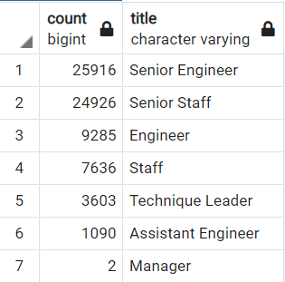

# Pewlett-Hackard-Analysis
## Overview of the Challenge
The purpose of this analysis is to create a linking relationship between various tables so that data can be extracted through those relationships. This requires creating an Entitly Relationship Diagram (ERD) as a way of visually mapping out the concept. The use of primary keys and foreign keys are the links that identifies and establishes the connect across the tables. An ERD example is shown below. Bobby works for Pewlett-Hackard and his job is to bring data on potential retirements in the coming years, along with a potential mentorship list, to his boss. The company may be going through a transitioning period with a large number of retirements.

#### Entitle Relationship Diagram

## Results
Three tables where created in response to the request

- Retirement Titles - a list of people who are retiring along with their title(s)
- Unique Titles - a list of people who are retiring with their latest title
- Retiring Titles - a count of how many people in each department is retiring

Bobby calculated and found that there are a large number of people who are going to retire soon. The top two departments with the most people are "Senior Engineer" and "Senior Staff" with 25,916 and 24,926 respectively. The rest of the department numbers are shown below.

#### Number of people who are retiring by departments

Per the boss, Bobby also created a mentorship list of people who can support the transition process. This mentorship program's purpose is to pair retiring workers with new employess to they can pass on their knowledge to the new group. With this list, Bobby has provided his boss with an option to support the transitional period.

#### List of potential mentors

## Summary
There are a total of 72,458 people who could retire soon. This means Pewlett-Hackard will need to come up with some solutions to fill the void. The list of eligible mentors is around 1,500 people. This means there may not be enough people to mentor or fill the many positions that will soon open up. Some recommendations and additional data to look at with this dilemma:
- review roles & responsibilities, consolidate and automate some task to lesson the position needs
- explore salary change and disburstment range for new employees
- identify the retirement percent per department
